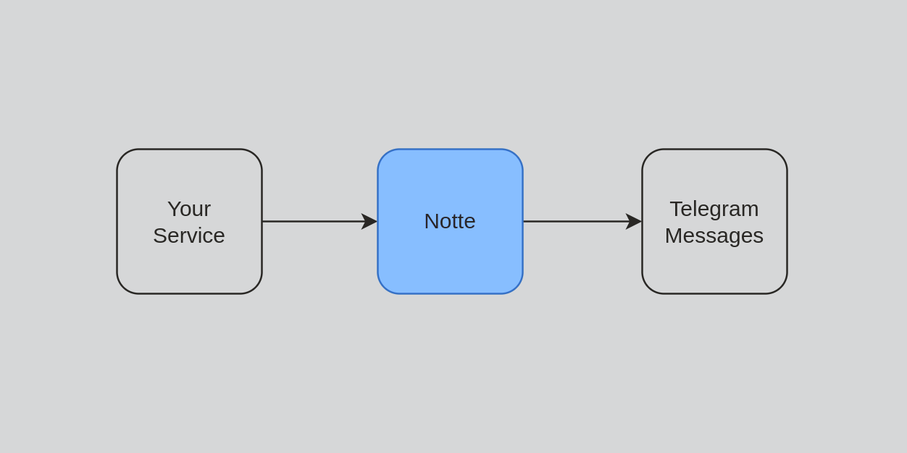

# About

If you want to send notifications from your application to yourself in Telegram, you can use Notte.


# Usage

Generate token in [@nottefication_bot](https://t.me/nottefication_bot) and send any message using token as bearer auth:
```shell
curl https://notte.daniil.online/api/log \
    -H 'Content-type: application/json' \
    -H 'Authorization: Bearer {token-from-bot}' \
    -d '{ "data": "Test message" }'
```

# Development

In order to run the project, you should follow these steps:

1. Install & run ngrok: `ngrok http 8000`
2. Fill environment variables:
    - `cp .env.example .env`
    - Generate bot token via [@BotFather](https://t.me/botfather) and set `TELEGRAM_BOT_TOKEN` variable
    - Copy url from ngrok and set `APP_URL`
3. Launch project: `docker compose up --build`

# Deployment

1. Locally deploy for the new version: `./deploy.sh`
2. On the server set/update all .env variables
3. `docker pull trckster/notte`
4. Change traefik network inside `docker-compose.prod.yml` if needed
5. `docker compose -f docker-compose.prod.yml up -d`
